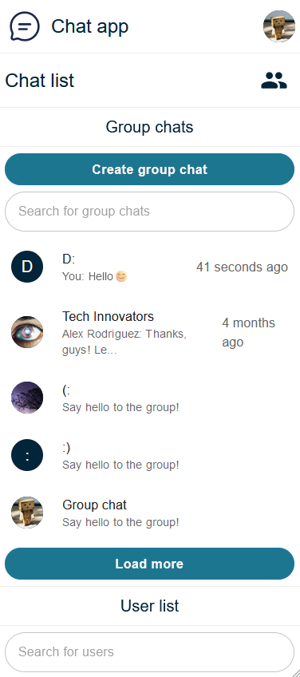

<a name="readme-top"></a>

<!-- PROJECT LOGO -->
<br />
<div align="center">
  <a href="https://github.com/gabrielius-dev/chat-app">
    
  </a>

  <h3 align="center">chat-app</h3>

  <p align="center">
    <a href="https://chat-app-xu4a.onrender.com">View Live</a>
    • 
    <a href="https://github.com/gabrielius-dev/chat-app-server">Server Repository</a>
  </p>
</div>

<!-- TABLE OF CONTENTS -->

<details>
  <summary>Table of Contents</summary>
  <ol>
    <li>
      <a href="#about-the-project">About The Project</a>
    </li>
    <li>
      <a href="#technologies-used">Technologies Used</a>
    </li>
       <li>
      <a href="#key-features">Key Features</a>
      <ul>
        <li><a href="#messaging">Messaging</a></li>
        <li><a href="#group-chats">Group Chats</a></li>
        <li><a href="#user-profile">User Profile</a></li>
      </ul>
    </li>
    <li><a href="#mobile-design">Mobile Design</a></li>
    <li>
      <a href="#getting-started">Getting Started</a>
    </li>
    <li><a href="#contact">Contact</a></li>
    <li><a href="#demo-environment">Demo Environment</a></li>
  </ol>
</details>

<!-- ABOUT THE PROJECT -->

## About The Project

[![Website screenshot][website-screenshot]](https://chat-app-xu4a.onrender.com)

Explore an advanced real-time messaging platform crafted with React and Typescript on the frontend, and driven by Node.js, Express.js, and Typescript on the backend. This platform guarantees a dynamic user experience, with real-time messaging functionalities seamlessly enabled by Socket.io. Enjoy seamless updates for messages, enhancing the overall interactivity of the application. The project is meticulously designed to be fully responsive, ensuring an optimal and consistent user experience across a variety of devices.

<p align="right">(<a href="#readme-top">back to top</a>)</p>

<!-- TECHNOLOGIES USED -->

## Technologies Used

  <ul>
    <li>Front-end: React, Typescript</li>
    <li>Back-end: Node.js, Express.js, Typescript</li>
    <li>Authentication: Passport, Express-sessions</li>
    <li>Real-time Communication: Socket.io</li>
    <li>Database: MongoDB</li>
    <li>Image Storage: Cloudinary</li>
    <li>Testing: Vitest, React Testing Library</li>
  </ul>

Please note that testing in this project is limited and primarily serves as a learning exercise rather than comprehensive coverage. Due to the personal nature of this project, only a handful of tests have been implemented to get familiar with testing environments. The tests do not aim to validate 100% of the project's functionality.

<p align="right">(<a href="#readme-top">back to top</a>)</p>

<!-- KEY FEATURES -->

## Key Features

### Messaging

Immerse yourself in the world of real-time messaging, where the ability to effortlessly send and delete messages enhances the fluidity of your conversations. Expressing emotions is made more vivid with a diverse range of emojis, while sharing multiple images within a single message elevates your communication to a richer level.

![][messaging-gif]
&nbsp;
&nbsp;
&nbsp;
![][send-images-gif]

### Group Chats

Effortlessly manage group conversations to suit your needs. The app enables you to create, edit, and delete group chats seamlessly, allowing for a tailored communication experience. Add avatars to each group, providing a distinct visual identity to enhance the sense of community.

![][group-chat-gif]

### User Profile

Tailor your user profile effortlessly to reflect your individuality. Whether it's adding a profile picture, updating your username, or including a bio, the app empowers you to present yourself authentically within the platform.

![][edit-profile-gif]

<p align="right">(<a href="#readme-top">back to top</a>)</p>

<!-- MOBILE DESIGN -->

## Mobile Design

The project is fully responsive, providing an optimal user experience on both desktop and mobile devices.

<div style="display: flex;">
    
    &nbsp;
    &nbsp;
    &nbsp;
    
</div>

<p align="right">(<a href="#readme-top">back to top</a>)</p>

<!-- GETTING STARTED -->

## Getting Started

To get a local copy up and running follow these simple example steps.

1. **Clone the Repository**

   ```sh
   git clone https://github.com/gabrielius-dev/chat-app
   ```

2. **Install NPM packages**

   ```sh
   npm install
   ```

3. **Create a `.env` file in the root folder and add the following variable**

   ```text
   VITE_BACK_END_URL=http://localhost:8000
   ```

4. **Run the development server**

   ```sh
   npm run dev
   ```

5. **Set up the Server Repository**

   - If you haven't already, clone the server repository by following the instructions in the [Real-Time Messaging App - Server Repository](https://github.com/gabrielius-dev/chat-app-server).

<p align="right">(<a href="#readme-top">back to top</a>)</p>

<!-- CONTACT -->

## Contact

Email: personal.gabrielius@gmail.com

<p align="right">(<a href="#readme-top">back to top</a>)</p>

<!-- DEMO ENVIRONMENT -->

## Demo Environment

Please note that the content within this application is populated with fake data for demonstration purposes. The user profiles, including profile pictures and bios, as well as group chats and messages, have been artificially created to showcase the various features of the app. This simulated data is not representative of real users or conversations.

Feel free to explore and interact with the app to understand its functionalities. If you have any questions or suggestions, don't hesitate to reach out.

Happy messaging! 🚀

<p align="right">(<a href="#readme-top">back to top</a>)</p>

<!-- MARKDOWN LINKS & IMAGES -->

[website-screenshot]: ./github_assets/project-screenshot.png
[edit-profile-gif]: ./github_assets/edit-profile.gif
[group-chat-gif]: ./github_assets/group-chat.gif
[send-images-gif]: ./github_assets/send-images.gif
[messaging-gif]: ./github_assets/messaging.gif
[mobile-design-1]: ./github_assets/mobile-design-1.png
[mobile-design-2]: ./github_assets/mobile-design-2.png
